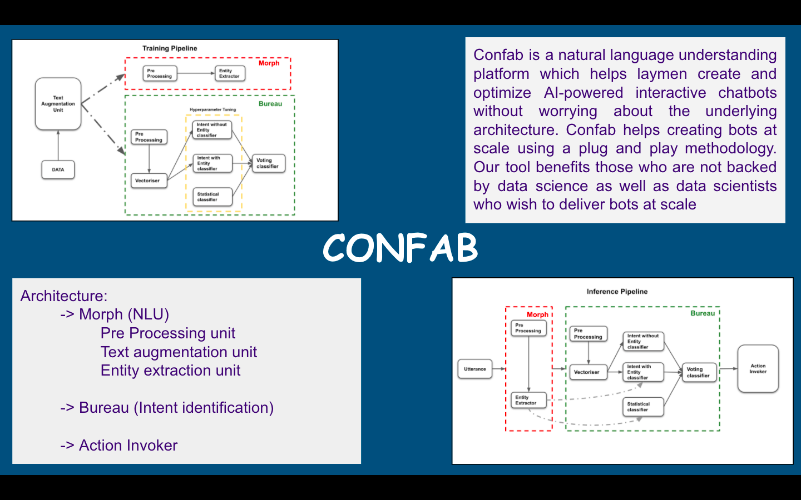
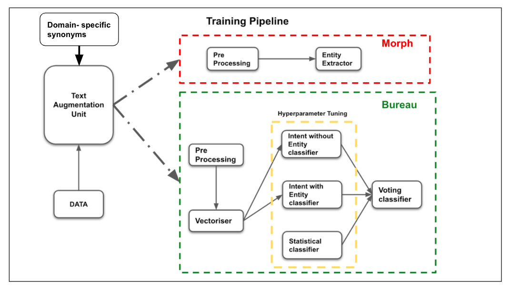

<p align="center"></p>
<p align="center">
    
    <h1 align="center">Confab</h1>
    <p align="center">Confab is a natural language understanding platform which helps laymen create and
optimize AI-powered interactive chatbots without worrying about the underlying architecture. Confab helps creating bots at scale using a plug and play methodology. Our tool benefits those who are not backed by data science as well as data scientists who wish to deliver bots at scale
</p>
    <p align="center">
        <a></a>
        <br>
        
    </p>
</p>

## Architecture Diagram
<p align="center">

</p>

## Usage

### Training

### Testing

### REST Service

Once all the models are trained, Confab will start acting as bot-as-a-service.
REST endpoint is served using FastAPI.

```
uvicorn app:api --host 0.0.0.0 --port <PORT_NUMBER>  --reload
```


